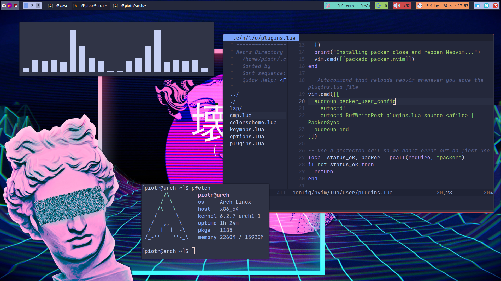
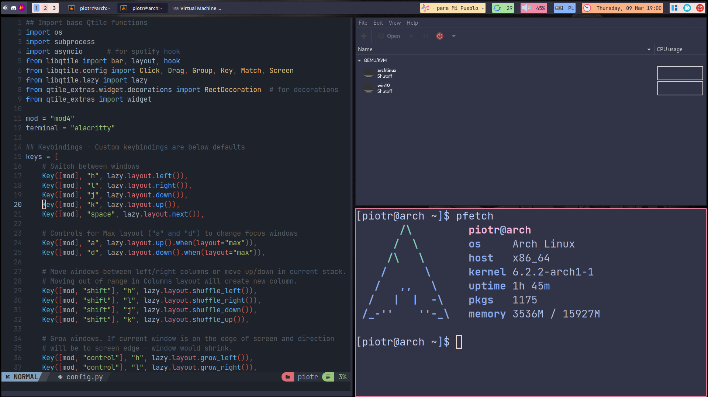
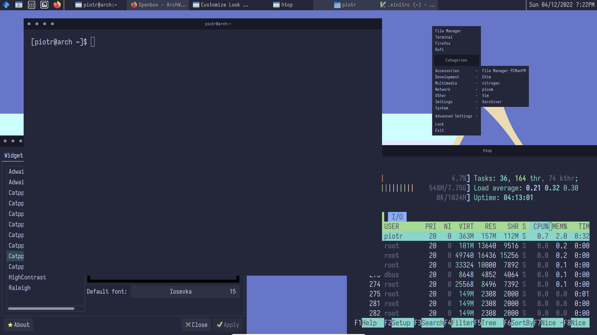
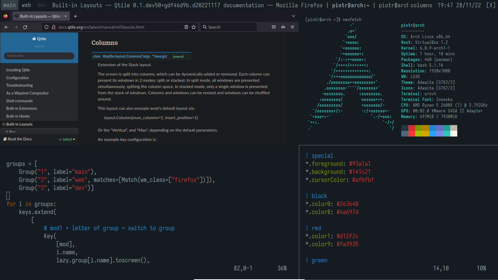

# Latest configs/builds at [my dotfiles repo](https://github.com/piotr-marendowski/dotfiles) (Qtile and DWM)!

## dotfiles-gallery
My Arch Linux configuration files for various window managers and programs that I use on my machine.

### Main Qtile (Tokyo Night):

### Main Qtile (Catppuccin):

### Previous Qtile:

### Openbox:

### Qtile:

